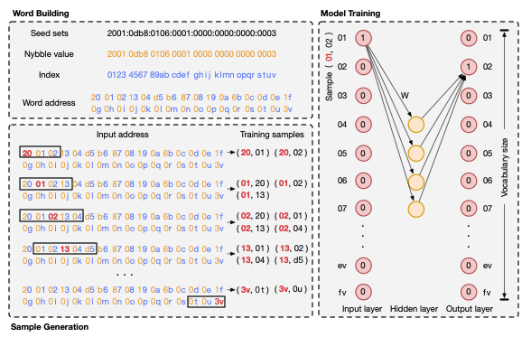
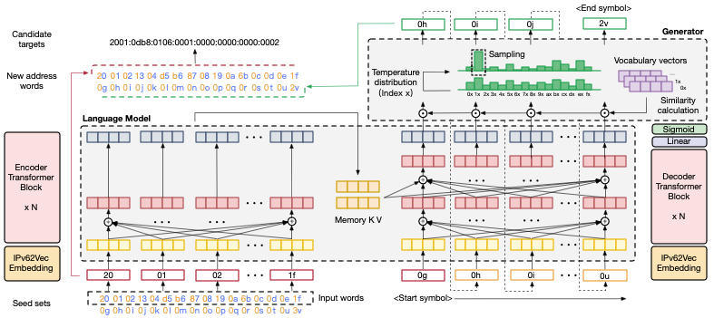

# 6VecLM

## Requirements

* Python 3.7
* Torch 1.3.1
* Gensim
* Sklearn

## Introduction

Apply Word2Vec and Transformer network to generating candidate active address sets.





The illustration of 6VecLM. 6VecLM contains two components IPv62Vec and Transformer-IPv6. IPv62Vec maps the entire active ad- dress space to a semantic vector space, where addresses with similar sequences will be classified into the same cluster. Semantic address vectors will be learned by Transformer-IPv6 to implement IPv6 language modeling.

The research paper [6VecLM: Language Modeling in Vector Space for IPv6 Target Generation](https://ecmlpkdd2020.net/programme/accepted/#ADSTab) has been accepted at the European Conference on Machine Learning and Principles and Practice of Knowledge Discovery in Databases (ECMLPKDD 2020).

Note: this code is based on [The Annotated Transformer](https://nlp.seas.harvard.edu/2018/04/03/attention.html). Many thanks to the author.

## Quickstart

6VecLM consists of three commands:

1. Build address word from data set.

```
$ python data_processing.py
```

2. Train IPv62Vec model and generate word / address distribution in the vector space.

```
$ python IPv62Vec.py
```

3. Train IPv6-Transformer model and generate candidate set.

```
$ python IPv6_Transformer.py
```

If the model has been trained, you can use `load_model.py` to directly generate other candidate sets.

```
$ python load_model.py
```


